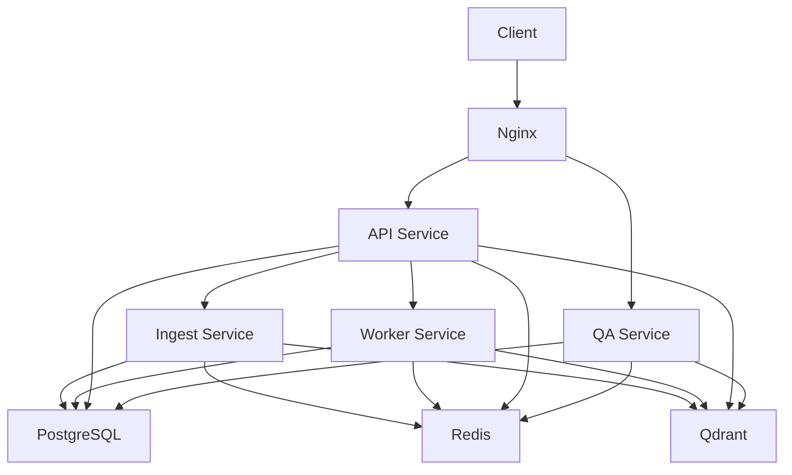

# LERK System Services

This directory contains dockerized microservices for the LERK (Logic Extraction and Reasoning Knowledge) System. The services are designed to be scalable, maintainable, and easily deployable.

## 🏗️ Service Architecture

The LERK System consists of four main microservices:

### 📄 **Ingest Service** (`ingest_service/`)
Handles document ingestion and initial processing.

**Features:**
- Document parsing and chunking
- Chunk enrichment
- Logic extraction
- Async processing support
- Batch processing capabilities

**Port:** 8001 (internal)

### 🌐 **API Service** (`api_service/`)
Provides REST API endpoints for the LERK System.

**Features:**
- Document upload and management
- Question answering endpoints
- Service status and health checks
- Background task processing
- Session management

**Port:** 8000 (external)

### ⚙️ **Worker Service** (`worker_service/`)
Handles background processing tasks.

**Features:**
- Document clustering
- Knowledge consolidation
- Retrieval indexing
- Task queue management
- Parallel processing

**Port:** 8002 (internal)

### 🤖 **QA Service** (`qa_service/`)
Provides question answering capabilities.

**Features:**
- Question processing
- Session management
- Document search
- Knowledge summarization
- Context-aware responses

**Port:** 8003 (external)

## 🚀 Quick Start

### 1. Prerequisites

- Docker and Docker Compose
- Environment configuration

### 2. Environment Setup

```bash
# Copy environment template
cp services/env.example services/.env

# Edit configuration
nano services/.env
```

### 3. Start Services

```bash
# Start all services
cd services
docker-compose up -d

# Check service status
docker-compose ps

# View logs
docker-compose logs -f
```

### 4. Stop Services

```bash
# Stop all services
docker-compose down

# Stop and remove volumes
docker-compose down -v
```

## 📋 Service Details

### Ingest Service

**Purpose:** Document ingestion and initial processing

**Endpoints:**
- Health check: `http://localhost:8001/health`
- Status: `http://localhost:8001/status`

**Configuration:**
```yaml
environment:
  - MAX_WORKERS=4
  - BATCH_SIZE=10
  - TIMEOUT=300
  - RETRY_ATTEMPTS=3
```

**Usage:**
```bash
# Process single document
python services/ingest_service/main.py input.pdf output/

# Process batch
python services/ingest_service/main.py batch_input/ output/
```

### API Service

**Purpose:** REST API for document management and Q&A

**Endpoints:**
- `GET /` - Service information
- `GET /health` - Health check
- `POST /documents/upload` - Upload document
- `GET /documents/{id}/status` - Document status
- `POST /questions/ask` - Ask question
- `GET /documents` - List documents
- `DELETE /documents/{id}` - Delete document
- `GET /stats` - Service statistics

**Configuration:**
```yaml
environment:
  - API_HOST=0.0.0.0
  - API_PORT=8000
  - API_WORKERS=4
```

**Usage:**
```bash
# Start API service
python services/api_service/main.py

# Test API
curl http://localhost:8000/health
```

### Worker Service

**Purpose:** Background processing tasks

**Features:**
- Clustering tasks
- Consolidation tasks
- Retrieval indexing
- Task queue management

**Configuration:**
```yaml
environment:
  - MAX_WORKERS=4
  - TASK_TIMEOUT=300
  - POLL_INTERVAL=10
  - RETRY_ATTEMPTS=3
```

**Usage:**
```bash
# Start worker service
python services/worker_service/main.py

# Add task programmatically
# (See service code for examples)
```

### QA Service

**Purpose:** Question answering and knowledge retrieval

**Features:**
- Question processing
- Session management
- Document search
- Knowledge summarization

**Configuration:**
```yaml
environment:
  - MAX_SESSIONS=1000
  - SESSION_TIMEOUT=3600
  - RETRY_ATTEMPTS=3
```

**Usage:**
```bash
# Start QA service
python services/qa_service/main.py

# Ask question
python services/qa_service/main.py "What is machine learning?" session_123
```

## 🔧 Configuration

### Environment Variables

```bash
# Database Configuration
DATABASE_NAME=lerk_db
DATABASE_USER=user
DATABASE_PASSWORD=password
DATABASE_PORT=5432

# Redis Configuration
REDIS_URL=redis://localhost:6379/0

# Vector Database Configuration
QDRANT_URL=http://localhost:6333
QDRANT_API_KEY=

# OpenAI Configuration
OPENAI_API_KEY=your_openai_api_key_here
OPENAI_MODEL=gpt-4o-mini
OPENAI_TEMPERATURE=0.1

# Logging Configuration
LOG_LEVEL=INFO
LOG_FORMAT=json

# Processing Configuration
MAX_WORKERS=4
BATCH_SIZE=10
TIMEOUT=300
RETRY_ATTEMPTS=3

# API Configuration
API_PORT=8000
API_WORKERS=4

# Session Configuration
MAX_SESSIONS=1000
SESSION_TIMEOUT=3600

# Task Configuration
TASK_TIMEOUT=300
POLL_INTERVAL=10
```

### Docker Compose Configuration

The `docker-compose.yml` file configures:

- **PostgreSQL** - Main database
- **Redis** - Caching and session storage
- **Qdrant** - Vector database
- **LERK Services** - All four microservices
- **Nginx** - Reverse proxy and load balancer

### Nginx Configuration

The `nginx.conf` file provides:

- **Load balancing** - Distribute requests across services
- **Rate limiting** - Prevent abuse
- **SSL termination** - HTTPS support
- **Health checks** - Service monitoring

## 📊 Monitoring and Logging

### Health Checks

Each service provides health check endpoints:

```bash
# Check service health
curl http://localhost:8000/health  # API Service
curl http://localhost:8003/health  # QA Service
```

### Logging

All services log to:

- **Console** - Standard output
- **Files** - `logs/service_name.log`
- **Structured** - JSON format for easy parsing

### Metrics

Services provide statistics endpoints:

```bash
# Get service statistics
curl http://localhost:8000/stats
```

## 🔄 Service Communication

### Internal Communication

Services communicate through:

- **Database** - PostgreSQL for persistent data
- **Redis** - Caching and session storage
- **Qdrant** - Vector similarity search
- **HTTP** - REST API calls

### External Communication

- **API Service** - Main entry point for clients
- **QA Service** - Direct question answering
- **Nginx** - Load balancing and routing

## 🚨 Troubleshooting

### Common Issues

1. **Service Startup Failures**
   ```bash
   # Check logs
   docker-compose logs service_name
   
   # Check health
   docker-compose ps
   ```

2. **Database Connection Issues**
   ```bash
   # Check database status
   docker-compose logs postgres
   
   # Test connection
   docker-compose exec postgres psql -U user -d lerk_db
   ```

3. **Memory Issues**
   ```bash
   # Check resource usage
   docker stats
   
   # Adjust worker counts
   # Edit docker-compose.yml
   ```

4. **Network Issues**
   ```bash
   # Check network connectivity
   docker-compose exec lerk-api ping postgres
   
   # Check DNS resolution
   docker-compose exec lerk-api nslookup postgres
   ```

### Performance Optimization

1. **Scale Services**
   ```bash
   # Scale API service
   docker-compose up -d --scale lerk-api=3
   
   # Scale worker service
   docker-compose up -d --scale lerk-worker=2
   ```

2. **Resource Limits**
   ```yaml
   # Add to docker-compose.yml
   deploy:
     resources:
       limits:
         memory: 2G
         cpus: '1.0'
   ```

3. **Caching**
   ```bash
   # Enable Redis caching
   # Configure cache TTL
   # Use connection pooling
   ```

## 📚 Development

### Local Development

```bash
# Start development environment
docker-compose -f docker-compose.dev.yml up -d

# Run tests
docker-compose exec lerk-api python -m pytest tests/

# Debug service
docker-compose exec lerk-api python -m pdb main.py
```

### Adding New Services

1. Create service directory
2. Add Dockerfile
3. Update docker-compose.yml
4. Add to nginx.conf
5. Update documentation

### Service Dependencies



## 🔒 Security

### Production Considerations

1. **Environment Variables**
   - Use secrets management
   - Rotate API keys regularly
   - Secure database credentials

2. **Network Security**
   - Use internal networks
   - Enable SSL/TLS
   - Configure firewalls

3. **Access Control**
   - Implement authentication
   - Use rate limiting
   - Monitor access logs

4. **Data Protection**
   - Encrypt sensitive data
   - Use secure connections
   - Regular backups

## 📄 License

This project is licensed under the MIT License - see the `LICENSE` file for details.

## 🤝 Contributing

When adding new services:

1. Follow the existing structure
2. Add comprehensive documentation
3. Include health checks
4. Add monitoring capabilities
5. Update docker-compose.yml
6. Test thoroughly

## 📞 Support

For issues and questions:

1. Check the logs
2. Review the documentation
3. Test individual services
4. Check service dependencies
5. Verify configuration
